# Design Document: subdomain-masker

## Overview

`subdomain-masker` is a Cloudflare Worker that performs transparent subdomain proxying (URL cloaking). It intercepts HTTP requests arriving at configured subdomains, fetches content from a mapped external (Upstream) URL, and returns that content to the client without ever redirecting the browser — keeping the original subdomain visible in the address bar.

The Worker is **configuration-driven**: adding a new subdomain-to-target mapping requires only a configuration change, not a code change. The authoritative source for mappings is the Worker's runtime environment (Cloudflare environment variables or KV); a hard-coded constant in the source file serves as a fallback.

Key responsibilities of the Worker:

- Route requests to the correct Upstream based on the Route Map.
- Rewrite HTML responses so relative asset requests stay on the masked subdomain.
- Apply a fixed set of security headers to every response.
- Handle CORS preflight requests.
- Expose a health check endpoint.
- Emit structured logs for every proxied request and every error.

---

## Architecture

The Worker runs entirely inside the Cloudflare edge network. There is no persistent server, database, or queue; all state lives in the environment configuration and in the in-flight request/response objects.

```mermaid
flowchart TD
    Client -->|HTTP request| Worker

    subgraph Worker["Cloudflare Worker"]
        direction TB
        A[Request Router] --> B{Route type?}
        B -->|OPTIONS| C[CORS Handler]
        B -->|GET /_health| D[Health Check Handler]
        B -->|GET/POST/HEAD + known subdomain| E[Proxy Handler]
        B -->|Unknown subdomain / apex| F[404 Handler]
        B -->|No route map| G[503 Handler]

        E --> H[Build Pass-Through Request]
        H --> I[Fetch from Upstream]
        I -->|2xx HTML| J[HTML Rewriter]
        I -->|2xx non-HTML| K[Pass body through]
        I -->|4xx / 5xx| L[Propagate status]
        I -->|Network error| M[502 Handler]
        I -->|Timeout| N[504 Handler]
        I -->|>5 redirects| O[502 Too Many Redirects]

        J --> P[Apply Security Headers]
        K --> P
        L --> P
        C --> P
        D --> P
        F --> P
        G --> P
        M --> P
        N --> P
        O --> P
    end

    Worker -->|Upstream fetch| Upstream["External Upstream Server"]
    P -->|Masked Response| Client
```



### Request Lifecycle

1. **Receive** – the Worker's `fetch` handler is invoked by the Cloudflare runtime.
2. **Classify** – the router inspects the request method and path to decide which handler runs.
3. **Resolve Route Map** – the proxy handler reads the Route Map (env → fallback constant).
4. **Fetch Upstream** – a sanitised copy of the request is sent to the Target URL. Redirects are followed up to a limit of 5.
5. **Rewrite** – HTML responses have absolute Upstream URLs rewritten to root-relative paths using the Cloudflare `HTMLRewriter` API.
6. **Secure** – security headers are applied (and `Server` / `X-Powered-By` stripped) on every outbound response.
7. **Log** – a structured JSON entry is written to `console.log` or `console.error`.
8. **Return** – the finished response is sent back to the client.

---

## Components and Interfaces

### 1. `fetch` Entry Point

The standard Cloudflare Worker export. Receives `(request: Request, env: Env, ctx: ExecutionContext)` and delegates to the router.

```typescript
export default {
  async fetch(request: Request, env: Env, ctx: ExecutionContext): Promise<Response>
}
```

### 2. Router

Pure routing logic. Inspects `request.method` and `new URL(request.url).pathname` to dispatch to the correct handler. Returns the handler's `Response`.

```typescript
function route(request: Request, env: Env): Promise<Response>;
```

Decision order (first match wins):

| Condition                    | Handler              |
| ---------------------------- | -------------------- |
| `method === 'OPTIONS'`       | CORS Handler         |
| `pathname === '/_health'`    | Health Check Handler |
| Route Map is empty           | 503 Handler          |
| Subdomain found in Route Map | Proxy Handler        |
| No subdomain / apex domain   | 404 Handler          |
| Subdomain not in Route Map   | 404 Handler          |

### 3. Route Map Resolver

Reads the environment for a `ROUTE_MAP` JSON string (or individual `SUBDOMAIN_<name>` vars) and parses it into a plain `Record<string, string>`. Falls back to the `DEFAULT_ROUTE_MAP` constant if the environment yields nothing.

```typescript
function resolveRouteMap(env: Env): Record<string, string>;
```

### 4. Subdomain Extractor

Given a `hostname` string, extracts the leftmost label. Returns `null` for apex domains (no dot present) or empty strings.

```typescript
function extractSubdomain(hostname: string): string | null;
```

### 5. Proxy Handler

Core proxying logic:

1. Builds a `PassThroughRequest` (strips `Host` and `CF-*` headers, sets correct `Host`).
2. Follows redirects manually up to `MAX_REDIRECTS = 5`.
3. Applies the `HTMLRewriter` when `Content-Type` is `text/html` and status is 2xx.
4. Strips `Server` and `X-Powered-By` from the upstream response headers.

```typescript
async function handleProxy(
  request: Request,
  targetUrl: string,
  subdomain: string,
): Promise<Response>;
```

### 6. HTML Rewriter

Uses the Cloudflare `HTMLRewriter` API to transform absolute Upstream origin URLs within `href`, `src`, `action`, and `srcset` attributes to root-relative paths. Runs in streaming fashion — no full-body buffering required.

```typescript
function rewriteHtml(response: Response, upstreamOrigin: string): Response;
```

> **`srcset` parsing caveat:** The `srcset` attribute contains a comma-separated list of URL + optional descriptor pairs (e.g. `https://origin.com/img.jpg 320w, https://origin.com/img@2x.jpg 640w`). The `HTMLRewriter` delivers the full attribute value as a single string. The implementation must split on `,`, extract the URL token (first whitespace-delimited segment of each part), rewrite it if it starts with `upstreamOrigin`, and reconstruct the full attribute value. A simple `startsWith` check on the raw attribute string is insufficient.

### 7. Security Headers Applier

Takes any `Response`, clones its headers, sets all required `Security_Headers`, removes `Server` and `X-Powered-By`, and returns a new `Response` with the modified headers.

```typescript
function applySecurityHeaders(response: Response): Response;
```

### 8. CORS Handler

Returns `204 No Content` with the required CORS headers immediately, without consulting the Route Map.

```typescript
function handleCors(): Response;
```

### 9. Health Check Handler

Validates `method === 'GET'`. Returns `200 {"status":"ok"}` or `405 Method Not Allowed`.

```typescript
function handleHealthCheck(request: Request): Response;
```

### 10. Logger

Writes structured JSON entries. Separates normal request logging from error logging.

```typescript
function logRequest(entry: RequestLogEntry): void;
function logError(entry: ErrorLogEntry): void;
```

---

## Data Models

### `Env` (Worker Bindings)

```typescript
interface Env {
  /** JSON-encoded route map, e.g. '{"reward1":"https://..."}' */
  ROUTE_MAP?: string;
}
```

> **Note:** The initial implementation uses only the `ROUTE_MAP` string var (set via Cloudflare dashboard or `.dev.vars` locally). KV-based route management is a future enhancement and is **not** part of this implementation. The `.dev.vars` file (which holds local overrides of env vars) must be added to `.gitignore`.

### `RouteMap`

```typescript
type RouteMap = Record<string, string>; // subdomain → targetUrl
```

### `DEFAULT_ROUTE_MAP` (source-file constant)

```typescript
const DEFAULT_ROUTE_MAP: RouteMap = {
  reward1: "https://view.genially.com/670ed038d21493d4843b3e5b",
};
```

### `RequestLogEntry`

```typescript
interface RequestLogEntry {
  subdomain: string;
  targetUrl: string;
  method: string;
  status: number;
  durationMs: number;
}
```

### `ErrorLogEntry`

```typescript
interface ErrorLogEntry {
  errorType:
    | "upstream_failure"
    | "timeout"
    | "misconfiguration"
    | "unmatched_subdomain";
  subdomain: string;
  message: string;
}
```

### Security Headers (constant)

```typescript
const SECURITY_HEADERS: Record<string, string> = {
  "X-Content-Type-Options": "nosniff",
  "X-Frame-Options": "SAMEORIGIN",
  "Referrer-Policy": "no-referrer",
  "Content-Security-Policy":
    "default-src 'self' https:; img-src 'self' https: data:; style-src 'self' https: 'unsafe-inline'; script-src 'self' https: 'unsafe-inline'",
  "Access-Control-Allow-Origin": "*",
};

const HEADERS_TO_REMOVE = ["Server", "X-Powered-By"];
```

### CORS Preflight Headers (constant)

```typescript
const CORS_HEADERS: Record<string, string> = {
  "Access-Control-Allow-Origin": "*",
  "Access-Control-Allow-Methods": "GET, POST, HEAD, OPTIONS",
  "Access-Control-Allow-Headers": "Content-Type, Authorization",
  "Access-Control-Max-Age": "86400",
};
```

---

## Correctness Properties

_A property is a characteristic or behavior that should hold true across all valid executions of a system — essentially, a formal statement about what the system should do. Properties serve as the bridge between human-readable specifications and machine-verifiable correctness guarantees._

### Property 1: Route Map resolution precedence

_For any_ combination of environment-provided route map and source-file fallback constant, `resolveRouteMap()` SHALL return the environment map when it is non-empty, and the fallback constant when the environment map is absent or empty.

**Validates: Requirements 1.1**

### Property 2: Route Map lookup correctness

_For any_ route map containing between 1 and 100 entries, and for any subdomain key present in that map, the Worker SHALL proxy the request to the corresponding Target_URL — routing correctly without any change to the core routing logic.

**Validates: Requirements 1.2, 1.3, 2.1**

### Property 3: Pass-Through Request construction

_For any_ incoming request carrying an arbitrary mix of headers (including `Host` and `CF-*` prefixed headers) and any Target_URL, the constructed Pass-Through Request SHALL:

- preserve all headers that are neither `Host` nor `CF-*` prefixed,
- omit all `CF-*` prefixed headers and the original `Host` header, and
- set the `Host` header to `new URL(targetUrl).hostname`.

**Validates: Requirements 2.2, 2.3**

### Property 4: Redirect limit enforcement

_For any_ upstream redirect chain of length `n`:

- if `n ≤ 5`, the Worker SHALL follow all redirects and return the final upstream response,
- if `n > 5`, the Worker SHALL stop and return HTTP `502` with body `Too many redirects`.

**Validates: Requirements 2.4, 5.4**

### Property 5: HTML Upstream URL rewriting

_For any_ 2xx HTML response from an upstream at origin `O`, after `rewriteHtml()` is applied, none of the `href`, `src`, `action`, or `srcset` attribute values in the response body SHALL begin with origin `O`; all such absolute URLs SHALL have been replaced with their root-relative equivalents.

**Validates: Requirements 2.5**

### Property 6: Unmatched subdomain returns 404

_For any_ route map and any subdomain string that is not a key in that map, the Worker SHALL return HTTP `404` with body `Not found`.

**Validates: Requirements 3.1**

### Property 7: Apex domain returns 404

_For any_ hostname that contains no dot-delimited subdomain label (i.e., `extractSubdomain()` returns `null`), the Worker SHALL return HTTP `404` with body `Not found`.

**Validates: Requirements 3.2**

### Property 8: Security headers always applied

_For any_ response generated by the Worker — regardless of status code, handler, or upstream origin — all required Security Headers SHALL be present with their specified values, overwriting any pre-existing values for those header names.

**Validates: Requirements 4.1, 6.2**

### Property 9: Identifying headers stripped from proxied responses

_For any_ upstream response that contains a `Server` header, an `X-Powered-By` header, or both, the final response returned to the client SHALL contain neither of those headers.

**Validates: Requirements 4.2, 4.3**

### Property 10: Upstream error status propagation

_For any_ upstream response with HTTP status code `s` where `400 ≤ s ≤ 599` and `s` is not a Worker-generated error (502 from redirect limit / connection failure, 504 from timeout), the Worker SHALL return a Masked_Response with status `s` and the upstream's original response body verbatim.

**Validates: Requirements 5.1**

### Property 11: OPTIONS always returns CORS preflight response

_For any_ OPTIONS request — regardless of subdomain, path, or route map contents — the Worker SHALL return HTTP `204 No Content` with all required CORS preflight headers, short-circuiting all other routing.

**Validates: Requirements 6.1**

### Property 12: Non-GET requests to /\_health return 405

_For any_ HTTP method other than `GET`, a request to path `/_health` SHALL return HTTP `405 Method Not Allowed` with body `Method not allowed`.

**Validates: Requirements 7.3**

### Property 13: Proxy request log contains all required fields

_For any_ successfully proxied request, the JSON log entry emitted via `console.log` SHALL contain the fields `subdomain`, `targetUrl`, `method`, `status`, and `durationMs`, each with a value accurately reflecting the proxied request.

**Validates: Requirements 8.1**

### Property 14: Error log contains required fields for all error types

_For any_ error condition arising during request handling (upstream failure, timeout, misconfiguration, or unmatched subdomain), the JSON log entry emitted via `console.error` SHALL contain an `errorType` field with one of the four valid values and a `message` field identifying the affected subdomain and the reason for failure.

**Validates: Requirements 8.2**

### Property 15: No sensitive request data in log output

_For any_ request carrying a URL path, query string, or request headers, no log entry emitted by the Worker — via `console.log` or `console.error` — SHALL contain the request path, query string, or any header name/value from that request.

**Validates: Requirements 8.3**

---

## Error Handling

| Scenario                          | HTTP Status        | Body                         | Error Type (log)      |
| --------------------------------- | ------------------ | ---------------------------- | --------------------- |
| Route map empty / undefined       | 503                | `Service misconfigured`      | `misconfiguration`    |
| Subdomain not in route map        | 404                | `Not found`                  | `unmatched_subdomain` |
| Apex domain request               | 404                | `Not found`                  | `unmatched_subdomain` |
| Upstream network / DNS error      | 502                | `Upstream connection failed` | `upstream_failure`    |
| Upstream response timeout (>30 s) | 504                | `Upstream timed out`         | `timeout`             |
| Upstream redirect chain >5 hops   | 502                | `Too many redirects`         | `upstream_failure`    |
| Upstream 4xx / 5xx (pass-through) | _same as upstream_ | _upstream body_              | — (logged as request) |
| Non-GET to `/_health`             | 405                | `Method not allowed`         | —                     |

All error responses include `Content-Type: text/plain; charset=UTF-8` (except `/_health` 405 which is also plain text). Security headers are applied to every response, including error responses.

### Timeout Implementation

Cloudflare Workers do not expose a native per-fetch timeout in all environments. The 30-second upstream timeout is implemented using `Promise.race` with an `AbortController` signal set to 30 000 ms:

```typescript
const controller = new AbortController();
const timer = setTimeout(() => controller.abort(), 30_000);
try {
  const response = await fetch(url, {
    signal: controller.signal,
    redirect: "manual",
  });
  // ...
} catch (err) {
  if (err instanceof DOMException && err.name === "AbortError") {
    return new Response("Upstream timed out", { status: 504 });
  }
  return new Response("Upstream connection failed", { status: 502 });
} finally {
  clearTimeout(timer);
}
```

### Redirect Handling

Because `redirect: "follow"` hides intermediate responses, redirects are handled manually with `redirect: "manual"`. A loop increments a counter on each 3xx response; when the counter exceeds `MAX_REDIRECTS = 5`, the loop exits and returns 502.

---

## Testing Strategy

### Framework

The Worker is TypeScript, so the test stack will be:

- **Test runner**: [Vitest](https://vitest.dev/) (native ESM support, fast, integrates well with Wrangler/Miniflare)
- **Worker test harness**: [`@cloudflare/vitest-pool-workers`](https://developers.cloudflare.com/workers/testing/vitest-integration/) — runs tests inside an actual Workers runtime, giving access to `HTMLRewriter`, `Request`, `Response`, etc.
- **Property-based testing**: [fast-check](https://fast-check.io/) — mature, TypeScript-first, runs in any JS environment

PBT **is applicable** here. The Worker contains a significant amount of pure or near-pure business logic (route resolution, request sanitisation, HTML rewriting, header manipulation, log serialisation) where input variation reveals edge cases that example-based tests miss.

### Unit Tests (example-based)

Cover the specific, enumerated behaviors that do not vary meaningfully with input:

- `DEFAULT_ROUTE_MAP` contains the `reward1` entry.
- GET `/_health` returns `200 {"status":"ok"}` and does not call upstream.
- Empty route map returns `503 Service misconfigured`.
- Network fetch error returns `502 Upstream connection failed`.
- Timeout returns `504 Upstream timed out`.

### Property-Based Tests

Each property test corresponds directly to a numbered property in the Correctness Properties section.

Configuration:

- Minimum **100 iterations** per property test (fast-check default is 100; increase to 200 for Properties 3, 5, 13, 15).
- Each test is tagged with a comment referencing the originating design property.
- Tag format: `// Feature: subdomain-masker, Property N: <property_text>`

Property test outline:

| Test                            | Arb generators                                            | Assertion                                                            |
| ------------------------------- | --------------------------------------------------------- | -------------------------------------------------------------------- |
| P1 Route Map resolution         | `fc.record`, `fc.string` for map entries                  | `resolveRouteMap` returns env map when non-empty, fallback otherwise |
| P2 Route Map lookup             | `fc.dictionary` of subdomain→url, pick a key              | Request for that key → fetch to mapped URL                           |
| P3 Pass-Through Request         | `fc.record` of headers (mixed CF-\*, Host, regular) + URL | Output headers exclude Host/CF-\*, include correct Host              |
| P4 Redirect limit               | `fc.integer({min:0,max:10})` redirect chain length        | ≤5 → final response; >5 → 502                                        |
| P5 HTML rewriting               | `fc.string` origin URL, `fc.array` of attribute paths     | No upstream origin remains in output attributes                      |
| P6 Unmatched subdomain          | `fc.dictionary` route map, subdomain not in map           | 404                                                                  |
| P7 Apex domain                  | Hostnames without subdomain prefix                        | `extractSubdomain()` → null → 404                                    |
| P8 Security headers             | Any `Response` object (random status/headers)             | All SECURITY_HEADERS present with correct values                     |
| P9 Identifying headers stripped | Response with random Server / X-Powered-By values         | Neither header present in output                                     |
| P10 Upstream error propagation  | `fc.integer({min:400,max:599})` excluding 502/504         | Masked response status and body match upstream                       |
| P11 OPTIONS short-circuit       | Any OPTIONS request (random subdomain, path, route map)   | Always 204 + CORS headers                                            |
| P12 Non-GET to /\_health        | Any method except GET                                     | 405                                                                  |
| P13 Proxy log fields            | Any proxied request mock                                  | Log entry has all 5 required fields with correct values              |
| P14 Error log fields            | Any error condition                                       | Error entry has errorType ∈ valid set, message string                |
| P15 No sensitive data in logs   | Requests with random paths/query/headers                  | No path, query, or header data in any log output                     |

### Integration Tests

Run against a local Miniflare instance (or Wrangler dev):

- Verify the full Worker lifecycle for a mapped subdomain with a real (or mock) upstream.
- Verify redirect following up to the 5-hop limit.
- Verify `Access-Control-Allow-Origin` header presence on all response types.
